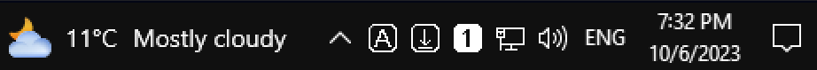
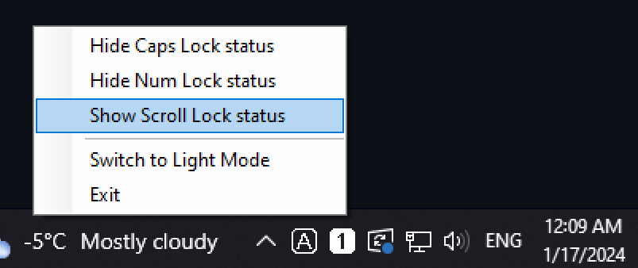
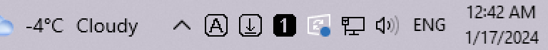

# Lock Keys Taskbar Indicator

This is a simple Windows widget that shows the status of Caps Lock, Num Lock and Scroll Lock keys on your taskbar.

## Installation

To install, download the latest release [here](https://github.com/maxisan137/Lock-Keys-Taskbar-Indicator/releases)

Starting from version 1.1.0, the app release is distributed as a .msi installer. Simply start it and follow the instructions.

Once installed, you can start the app from the created desktop shortcut - the icons should appear in your taskbar. The installer also adds a shortcut to your Startup folder, which means it will start automatically whenever you boot you computer.

**Important**: you may want to set up the icons to not be hidden in the taskbar tray. To do this, right click on your taskbar -> *Taskbar settings* -> *Select which icons appear on the taskbar* and enable any one of the **LockKeysTaskBarIndicator.exe** icons.

## Customizing

You can show/hide specific key icon by right clicking any one of them and selecting the option you need. This preference is saved and remembered every time the app is launched.

**New in v1.1**: The app now supports switching between Dark theme and a Light theme. So if some of you maniacs prefer your Windows taskbar white, you can now have proper contrast to that.

Upon first install and start, the app should automatically determine the system theme. After that, you can change it manually.

## Build from source

If you prefer to build the app yourself, rather than installing a compiled release, you can clone this repo, open the included Visual Studio solution and build it from there. The widget was developed in Visual Studio 2022, using .NET 7.0. The installer is made using WiX Toolset v4.
