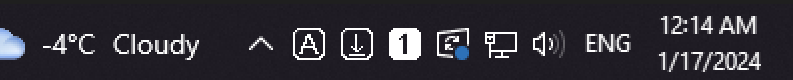

# Lock Keys Taskbar Indicator

This is a simple Windows widget that shows the status of Caps Lock, Num Lock and Scroll Lock keys on your taskbar.

## Installation

To install:

 - Download the latest release
 - Unzip the archive into any folder
 - Start the **LockKeysTaskBarIndicator.exe** executable

The app is now running and the icons should appear in your taskbar. Additionally, you may want to set up the icons to not be hidden in the taskbar tray. To do this, right click on your taskbar -> *Taskbar settings* -> *Select which icons appear on the taskbar* and enable any one of the **LockKeysTaskBarIndicator** icons.

To exit the app, simply right click on any one of the icons and choose the **Exit** option.

The app will automatically add itself to the Windows startup folder so it starts up every time you boot your PC. If you want to remove it from startup, simply go to your startup folder (**%appdata%\Microsoft\Windows\Start Menu\Programs\Startup**) and delete the app shortcut.

## Customizing

You can show/hide specific key icon by right clicking any one of them and selecting the option you need. This preference is saved and remembered every time the app is launched.

You are able to customize the way icons look by using your own *.ico* images. There are two ways to do it:

 - You can replace the original *.ico* files in the **icons** folder within the app folder.
 - Alternatively, you can save your custom icons elewhere and modify the icon file path in **config.json** file.

The **config.json** file is not including in the release, as it is generated automatically upon first startup of the app.

## Build from source

If you prefer to build the app yourself, rather than installing a compiled release, you can clone this repo, open the included Visual Studio solution and build it from there. The widget was developed in Visual Studio 2022, using .NET 7.0
